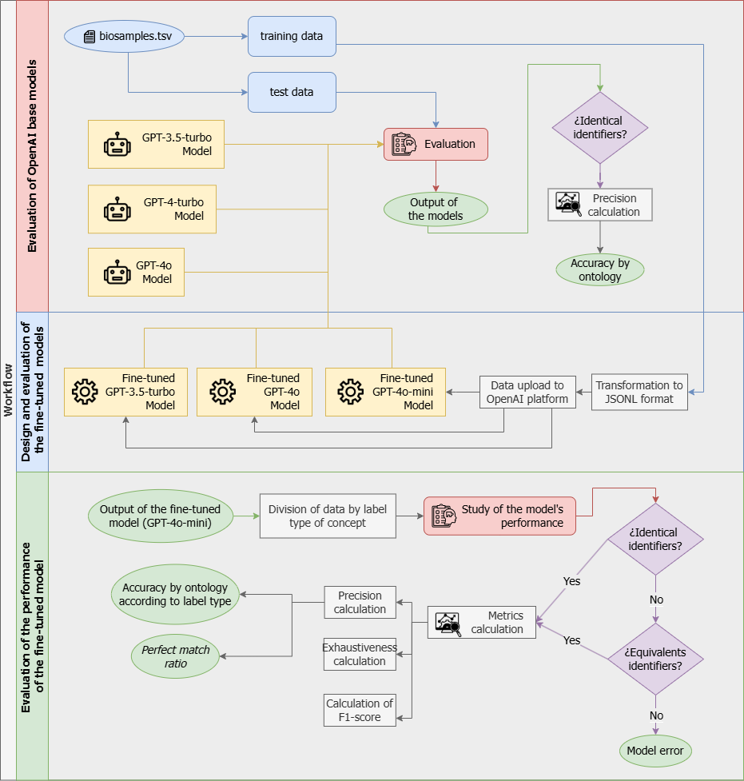

# BiosamplesLLMAnnotation


## Application of Large Language Models to automate the processes of semantic integration of biological data
Code used in the method and results obtained for the implementation of LLMs in semantics integration of biological data, specifically, OpenAI's GPT-3.5-turbo and GPT-4-turbo and GPT-4o models are used. In addition, two fine-tuned models were developed by performing a fine-tuning process on the GPT-3.5-turbo and GPT-4o-mini models. 

## Scripts
Scripts use one or more of the following libraries:
- **creation_ft.py**: Split data into a training set and a test set. Uploading data to OpenAI through its API and launching the fine-tuning job on the OpenAI GPT-3.5-turbo and GPT-4o-mini models.
- **get_ft_metrics.py**: Obtain the metrics to evaluate the training of the fine-tuned models.
- **ft_metrics_plot.py**: Once the metrics are obtained, they are plotted for analysis.
- **get_response_modelsOpenAI.py**: Obtain the response of the models of OpenAI for a given task. In this case, the model is asked to display suitable identifiers for each of the ontologies under study for each label of interest.
- **get_response_ft.py**: The same as in the previous script, but using the previously built fine-tuned models.
- **df_comparison.py**: Data manipulation and organization in order to compare the mappings proposed by the model and the reference mappings.
- **models_comparison.py**: Obtain the precision of each one of the models for each of the ontologies under study.
- **class_names.py**: Split data by label type and get the name of each identifier to analyze how the tuned model works.
- **pattern_analysis.py**: Look for a common pattern between the identifier class names and check if there is a valid relationship between them.
- **llm_contributions.py**: Filter out those cases where there is no reference identifier for a given tag but the model can propose a valid identifier.
- **calculate_FN**: Obtain the number of FN for each ontology.
- **match_analysis.py**: Obtain tuned model accuracy, recall and F1-score for each of the ontologies by label type.


## Dependencies
- **dotenv**: Read key-value pairs from a .env file and set them as environment variables.
- **openai**: The OpenAI Python library provides convenient access to the OpenAI REST API from any Python 3.7+ application-
- **sklearn.model_selection**: Tools for model selection, such as cross-validation and hyper-parameter tuning.
- **json**: Work with JSON data.
- **pandas**: Analysis and manipulation tool.
- **os**: Provides a portable way of using operating system-dependent functionality.
- **matplotlib.pyplot**: Low level graph plotting library in python that serves as a visualization utility.
- **requests**: Allows you to send HTTP requests using Python.

All dependencies are included in the **requirements.txt** file.

## Installing Requirements

### Prerequisites
- Ensure that Python 3.7 or higher is installed on your system.
- Make sure that `pip`, Python's package installer, is also available.
1. **Navigate to the Project Directory**
   Open your terminal (or command prompt) and navigate to the directory where the `requirements.txt` file is located:
   
   ```sh
   cd path/to/your/project-directory
   ```

2. **Install the Dependencies**
   Use `pip` to install all of the dependencies listed in the `requirements.txt` file:
   
   ```sh
   pip install -r requirements.txt
   ```

   This command will read each dependency from `requirements.txt` and install them automatically.

## Starting file
The starting file has the reference mappings made manually by the research group of the Computer Science and Systems Department of the University of Murcia.
- **biosamples.tsv**
